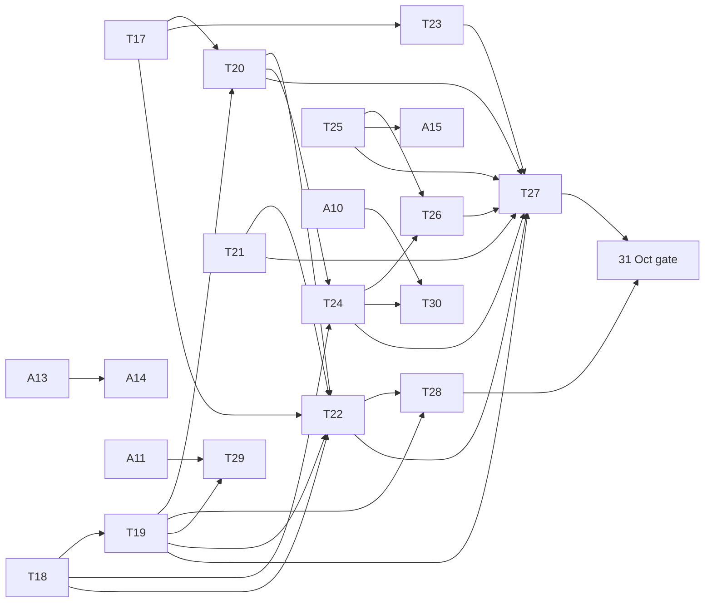

# V2 roadmap: the slice against the gates, the cut order, the cards, and spring 2027

Status: draft, 2026-10-07. For the orchestrator to merge and the owner to sign off. Source: the owner's v2 vision log
(2026-10-07), drafted as `V2-DECISIONS-DRAFT.md`. `docs/DECISIONS.md` outranks this page. Rules changes it relies on are
CR-004 (collar economy), CR-005 (boss phases, clock surge, tells), and CR-006 (ember spit).

The vision is **full v2, carve the slice**: the whole game is designed now, and the 18 Nov build is a coherent vertical
slice of it. That slice is **one full Tiro Games day of four bouts**, Cassia's route.

## 1. Where the project stands today

| Fact | Value | Source |
| --- | --- | --- |
| Red design gates on a clean tree | 3: `MageArenaDesign.Duel.FireSeated`, `Session.FullSeated`, `Session.Wave1Seated` | `CLAUDE.md` (as of 24bcdfc) |
| Wave 1 from a seat, live overlay | lost at 23.25 s | `docs/gameplay/08-session-arc.md` |
| Sunfall in seated duels, live overlay | 0 of 40 | DF-003 |
| Calibration | no overlay lands both gates; `wide` unsigned | DF-003 |
| Bout 2 perfects | 0 (bursts cannot reach the seat) | DF-004 |
| Session length, proposal overlay, with the teach | 105 s of bouts, about 2.8 min in all, against 7-10 min | T15 status line |
| Mirror II for the player | Ripple (branch B); Reflection never happens | `docs/gameplay/02-verbs-and-gestures.md` |
| Lash reach | cone 3 m, ring r 3 m; the nearest enemy body is about 3.5 m away | same; DF-004 |
| Mudra | clip only, no detector, glyph needs a design | same; `apps/vr/tasks/BACKLOG.md` |
| Live arc opponent | the Water proxy, not the Fire mage | `docs/campaign/02-vr-run-as-campaign.md` |
| Story on screen | none (24 instruction strings) | `docs/campaign/01-story-core.md` |
| Audio in the session | none wired (A05 cues exist) | same |
| Pace so far | T10-T15: six cards in two days, four of them needed a retry | card status lines |

## 2. What the vision adds

Second opponent school (Earth or Air, AI only) for the Tiro final; boss phases with a surge and a signature opener;
tells and interrupts; the mudra seal; Mirror II Reflection; the Leviathan / Rain pick; element-correct colour and threat
audio; between-bout scenes with choices on the stones; Septima's ritual; voiced lines; the collar economy; a
diegetic collar and crowd; the aftermath tablet; the split-hand latch fix and the Flow-5 Bolt.

**Capacity, honestly.** The three red gates have resisted one full calibration round. The vision adds roughly twice
the October work the plan had, and the art, animation and audio sprint (risk R0, R16) still starts on 19 Oct. The slice
is reachable only if the boss-phase rule (CR-005) closes the Sunfall gap structurally, which the census has not shown
yet, and only if the cut order below is applied on the dates named, not argued about on them.

## 3. The slice against the gates

| Gate | Date | Must be true | Cards |
| --- | --- | --- | --- |
| **Mechanics** | Sun 18 Oct | Latch fix and Lash reach; Reflection preset; Brennic as a boss with phases, surge and Sunfall opener in the live arc; tells and interrupts; ember spit; mudra detector and the tier IV pick; census v2 run with the three red gates re-specified to v2 targets | T17-T23 |
| **Design and animation checkpoint** | Fri 23 Oct | Owner plays a greybox Brennic duel replay; first animated opponent (idle, cast, hit, phase-break taunt); **decision: second school or Corvo** (section 4) | T22, A13 |
| **Content freeze** | Sun 25 Oct | Final opponent chosen and in the kernel; the scene runner and the stone choices; all slice lines written and voiced; collar counters wired | T24-T28, A11 |
| **Desktop core gate** | Sat 31 Oct | A full Tiro day plays on desktop in 7-10 min; every design gate green or explicitly re-specified by the owner; style, animation and audio on the slice | T29-T30, A10-A16 |
| **VR sprint** | 1-13 Nov | V1 device bring-up (4 Nov), V2 real hands (8 Nov: re-record the mudra and the latch timings), V3 beta and RC (11 and 13 Nov) | V-cards (plan section 5) |
| **Submit** | 14-18 Nov | Video, upload freeze 16 Nov, form | - |

Session budget for the slice: prologue scene 45 s, teach 63 s (measured), ritual 45 s, four bouts 2.4-4.1 min (25-40,
30-45, 45-80, 45-80 s), three intermissions at 20 s, aftermath 45 s. Total about 7.0-9.0 min, inside 7-10.

## 4. Cut order

Applied top first. Each cut names the date by which it is decided, so it is never decided under deadline pressure.

| # | Cut | Decide by | What the slice keeps |
| --- | --- | --- | --- |
| 1 | **Second school falls back to Corvo** (a second Ember entrant, AI style tweak and a different kit order). Owner's choice. | 23 Oct | A Tiro final with a named rival; no new kernel school |
| 2 | Pacts with other Tents | 23 Oct | Trust moves by the spare/finish choice only |
| 3 | Secrets at the intermissions | 23 Oct | One fixed rumour line on the aftermath tablet |
| 4 | Tithe's "jailers stronger later" consequence | 25 Oct | Tithe counted and shown; renown paid; no later effect in a one-day slice anyway |
| 5 | Named line combos and the pad-angle flank rule | 25 Oct | Flow as today |
| 6 | Reflection rallies beyond one return | 25 Oct | One reflection, the signature moment |
| 7 | Voiced lines beyond the core set (ritual, Brennic's two taunts, one line per scene) | 25 Oct | Text on the rail for the rest |
| 8 | Mirror IV and Lash IV (the plan's R4 order) | 31 Oct | Leviathan / Rain on Tide Orb |
| 9 | The Tiro final (bout 4) | 31 Oct | Three bouts ending on Brennic's semifinal (`docs/campaign/04` recommendation 1) |
| 10 | Bout 2, creatures (plan R4) | 4 Nov | Soldiers and the Brennic duel |
| 11 | Narrow-FOV mode (plan R4) | 8 Nov | Quest 3 default arc only |

Never cut: the Brennic boss duel with Sunfall, the ward perfect, blink, the mudra seal, Reflection once, missio.

## 5. Proposed task cards

Format: `apps/vr/tasks/_TEMPLATE.md`, summary level. "Grok-safe" means the rules are fully specified and the acceptance is
mechanical. "Claude + owner" means it needs design judgement, feel, or art acceptance.

| Card | Goal | Depends on | Acceptance | Worker |
| --- | --- | --- | --- | --- |
| **T17** Split-hand latch, Flow-5 Bolt, Lash reach | Latch clears after 0.3 s idle; a Bolt at Flow 5 fires without spending the Crest; Lash reaches the hold line (overlay) | - | New `MageArena.Hands.LatchIdle`, `Flow.BoltKeepsCrest`, `Water.LashReachesHoldLine` pass; conformance byte-identical | Grok-safe (Lash range: Claude picks the number) |
| **T18** Mirror II Reflection preset | VR player preset with Mirror branch A; a perfect on a projectile returns it to its caster | - | `MageArena.Water.ReflectReturns` (damage, owner, Cracks event emitted); `Duel.FireSeated` re-run logged | Grok-safe |
| **T19** Brennic as a boss | Live arc spawns the Fire mage labelled Brennic; CR-005 phases, surge, opener | T18 | CR-005 hand checks as tests; `Session.FullSeated` reaches the duel with Brennic | Grok-safe (rules); kit per phase Claude |
| **T20** Tells and interrupts | CR-005 tell rule for tier III+ and signatures; `interrupts` tags on Lash, reflection, Crest | T17, T19 | `MageArena.Ai.TellMinimum`, `Interrupt.LashCancelsPyre`, `Interrupt.BoltDoesNot` | Grok-safe |
| **T21** Ember spit | CR-006 row in the overlay; Bout 2 perfect practice | - | CR-006 hand checks; `Session.CreaturesSeated` green with ≥ 1 perfect | Grok-safe |
| **T22** Census v2 | Re-run DF-003 census with T17-T21: CR-005 targets plus Wave 1 and Bout 2 | T17-T21 | `MageArenaDesign.Census.Sweep` reproduces byte-identical; proposal file plus a DF-005 write-up | Grok runs; Claude + owner sign off |
| **T23** Mudra seal and the tier IV pick | Mudra detector; tier IV casts need the seal within 1.5 s; Leviathan / Rain chosen on a stone at the first intermission | T17 | `MageArena.Hands.MudraDetect`, `NoFalseMudra` (staff plant, ward), `Session.BranchPick` | Grok-safe detector; seal design Claude + owner (A12) |
| **T24** Collar counters | CR-004 Cracks and Tithe from kernel events; per-bout receipt fields; minimal `campaign.json` save | T18, T20 | One test per event; rejected sigil pays 0 Tithe; save round-trip and fold replay | Grok-safe |
| **T25** Scene runner and stone choices | A `scene` session phase: world-locked lines on the rail, voice playback, 3-stone palm choice (0.40 s hold), 20 s auto-continue | - | `MageArena.Scene.ChoiceHold`, `Scene.NoChoiceInBout`, `Scene.Skip` | Grok-safe runner; VR-only until TV commits `quest.ts` |
| **T26** Missio choice | Spare or finish at 0 HP, after the bout, on the stones; Cracks or Tithe and trust | T24, T25 | `Session.MissioSpare`, `Session.MissioFinish`; no choice during a bout | Grok-safe after the owner rules on "finish" |
| **T27** The Tiro day chain | Prologue, teach, ritual, four bouts, aftermath tablet; 7-10 min | T19-T26 | `Session.FullSeated` v2 green: whole day, length in band, Sunfall seen | Grok + Claude |
| **T28** The final's opponent | Either an Earth or Air AI-only kit with its defence (B or D), or Corvo (cut 1) | T19, T22 | `Duel.FinalSeated` in 45-80 s, win-rate bands | Corvo: Grok-safe. New school: Claude + owner |
| **T29** Opponent personality | AI style tweak per entrant; voiced phase-break taunts wired; reflection back by AI | T19, A11 | Style differences show in the census; taunts fire once per break | Claude + owner |
| **T30** Diegetic collar and crowd | Collar crack states (seen in the rail shield), crowd reactions to perfects, reflections, interrupts | T24, A10 | Captures reviewed; no head-locked UI | Grok greybox; Claude + owner accept |
| **A10** Element colour and threat audio | Fire is fire-coloured; every threat class has its sound (ring tone, steel, low drone) via ElevenLabs | - | Cue sheet complete; loudness balanced (BACKLOG A05 item) | Grok-safe from Claude's cue sheet |
| **A11** Voice lines | Pre-rendered ElevenLabs lines, ≤ 10 words each: Septima's ritual, Brennic's taunts, Ophel, the final opponent | Part A story; owner voice approval | Line count and word cap checked by script; owner auditions | Claude writes; Grok batches |
| **A12** Mudra seal design | The seal pose and glyph, deliberate, not a traced arch | - | Owner picks one | Claude + owner |
| **A13** Animated Brennic | Idle, cast, hit, phase-break taunt, kneel at missio | Style pick 19 Oct | Owner accepts at the 23 Oct checkpoint (R0) | Claude + owner |
| **A14** Collar and tablet art | Collar crack states; the aftermath tablet with the bout tallies | A13 style | Owner accepts | Claude + owner |
| **A15** Scene staging | Septima at the rail, Brennic on the floor, the ritual tableau; static camera | T25 | Comfort review; nothing from behind | Claude + owner |
| **A16** Music | Day theme, duel theme, phase-3 swell (owner in Flow Music; Claude writes the prompt sheets) | - | Owner approves | Owner + Claude |

## 6. Spring 2027 campaign milestones

| Milestone | Target | Content | Depends on |
| --- | --- | --- | --- |
| **S1 Runtime** | Jan 2027 | TV quest runtime committed and pinned; C++ port with TS-generated vectors (`docs/campaign/04` section 7); save fold over receipts and choices | TV commits `quest.ts` and `story/` |
| **S2 Veteranus day** | Feb 2027 | Cassia's second story day; Garran or Iskar as named semifinal rival; first pact choice; exhibition bouts open | S1, Earth or Air kernel |
| **S3 Earth and Air** | Feb 2027 | Both schools in the VR kernel with their seated defences (B stone form, D air form) and Footing / Momentum | Owner rules on Footing and Momentum |
| **S4 Primus day** | Mar 2027 | Third story day; secrets carried to the Summa; Tithe band consequences live | S2, S3 |
| **S5 Summa day** | Apr 2027 | The Breaking (tier V, CR-004), Champion and Betrayed endings | S4, TV tier V rows |
| **S6 Four routes** | May 2027 (launch) | Brennic, Garran and Iskar routes, each its own school as the player; all four schools playable | S3, S5 |

## Status and gaps

- Draft only. No card above is written in `apps/vr/tasks/` yet, and no CR is accepted by TV.
- The capacity estimate assumes the T10-T15 pace. Grok's balance ran out once already (T14 retry ran on agy).
- The 31 Oct gate also needs art, animation and audio "at high quality". This page does not reduce that bar.

## Open questions

- Is the Tiro final against Corvo a better slice than three bouts ending on Brennic, if both are possible?
- Does T25 wait for TV's `quest.ts` (the campaign 04 recommendation), or ship a VR-only runner for the slice and port
  later?
- Who voices the lines: one ElevenLabs voice per speaker, or a shared voice bank? It sets A11's generation count.
